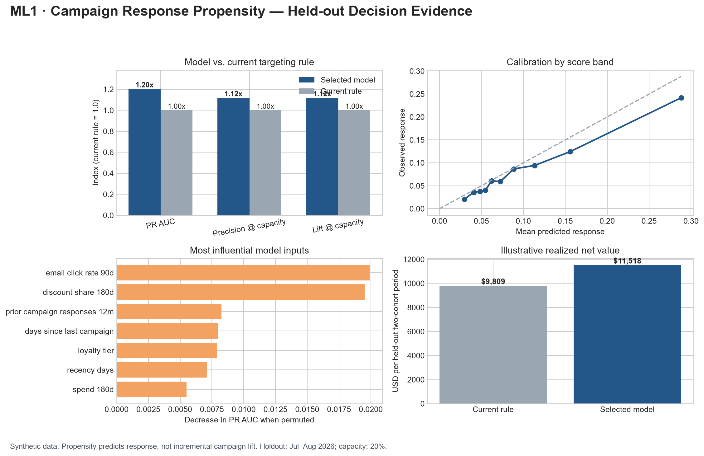

# Machine Learning Standard Framework

[](https://github.com/laura-rivera-sancho/machine-learning-standard-framework/actions/workflows/ci.yml)

**A decision-focused portfolio of supervised and unsupervised machine-learning systems built with reproducible evaluation, explainability, and operational controls.**

This repository demonstrates how I move from a business decision to a defensible model: defining supervised targets and unsupervised similarity contracts, preventing leakage, validating through time, comparing realistic candidates, evaluating operational decisions, explaining model behavior, and defining monitoring before deployment.

All companies, customer records, and results are fictional or synthetically generated. No employer, client, or confidential data are used.

## Portfolio review path

| What to assess | Start here | Evidence |
|---|---|---|
| Business and model decision | [ML1 stakeholder readout](supervised_learning/campaign_response_propensity/reports/stakeholder_readout.md) | Capacity-aware recommendation, economics, limits, and pilot design |
| Model evaluation | [ML1 expected results](supervised_learning/campaign_response_propensity/case_study/expected_results.md) | Temporal validation, baseline comparison, calibration, segments, and drivers |
| Technical implementation | [ML1 source](supervised_learning/campaign_response_propensity/src) | Deterministic data, data controls, model comparison, and reusable evaluation |
| Core concepts | [Campaign-response fundamentals](supervised_learning/campaign_response_propensity/campaign_response_fundamentals.md) | Leakage, temporal validation, ranking, calibration, propensity vs. uplift, and monitoring |
| Responsible operation | [ML1 model card](supervised_learning/campaign_response_propensity/model_card/model_card.md) | Intended use, exclusions, risks, controls, and monitoring thresholds |
| Unsupervised decision case | [ML2 stakeholder readout](unsupervised_learning/customer_segmentation/reports/stakeholder_readout.md) | Stable customer groups, activation hypotheses, limitations, and test gates |
| Segmentation evaluation | [ML2 expected results](unsupervised_learning/customer_segmentation/case_study/expected_results.md) | Candidate comparison, coverage, minimum size, resampling, and temporal stability |
| Segmentation concepts | [Customer-segmentation fundamentals](unsupervised_learning/customer_segmentation/customer_segmentation_fundamentals.md) | Algorithms, metrics, interpretation, stability, and causal boundaries |
| Portfolio sequence | [Roadmap](ROADMAP.md) | Supervised, transfer, unsupervised, and production-readiness milestones |




## Completed case studies

### ML1 — Campaign Response Propensity

Harbor & Pine has limited campaign capacity and needs to rank consented customers by their probability of responding within 14 days. The case compares Logistic Regression, a simple Decision Tree, HistGradientBoosting, and a transparent targeting rule using chronological Train, Validation, and Test cohorts.

On the July–August 2026 synthetic holdout, the selected HistGradientBoosting model:

- identifies **439 responders** in a **2,399-customer** contact capacity, versus **392** for the rule
- reaches **18.30% precision**, **45.68% recall**, and **2.28x lift** at capacity
- produces **$11,517.72** in illustrative net value, versus **$9,809.31** for the rule
- excludes post-campaign outcomes and protected personal characteristics from model inputs

The recommendation is a controlled shadow-mode and randomized pilot—not immediate automated rollout. Propensity predicts who is likely to respond; it does not estimate who responds because of treatment.

### ML2 — Customer Segmentation

Northstar Market needs stable behavioral groups to design differentiated lifecycle experiments beyond fixed RFM rules. The case compares K-means, Gaussian Mixture Models, and DBSCAN while treating separation, stability, coverage, minimum size, and actionability as joint requirements.

The selected four-cluster K-means solution segments 5,966 synthetic customers with 100% coverage, 0.846 bootstrap ARI, 0.717 temporal assignment ARI, and an 18.1% minimum segment share. It yields Champions, At Risk, Digital Growth, and Deal Seekers personas. These are planning hypotheses; randomized tests remain necessary before treatment decisions.

## Repository map

```text
machine-learning-standard-framework/
├── supervised_learning/
│   └── campaign_response_propensity/
│       ├── case_study/       # Decision contract, dictionary, results, monitoring
│       ├── data/             # Review sample and generated outputs
│       ├── model_card/       # Intended use, limitations, risks, controls
│       ├── reports/          # Stakeholder readout and executive visual
│       └── src/              # Generator, training, evaluation, and visualization
├── unsupervised_learning/
│   └── customer_segmentation/
│       ├── case_study/       # Decision contract, dictionary, results, monitoring
│       ├── data/             # Review sample and generated outputs
│       ├── model_card/       # Intended use, limitations, risks, controls
│       ├── reports/          # Stakeholder readout and executive visual
│       └── src/              # Generator, candidate comparison, and visualization
├── tests/                    # Model logic and repository integrity
├── ROADMAP.md
└── README.md
```

No challenge notebooks are included. The reference workflow is implemented as tested source code so evaluation logic is reusable and reviewable.

## Reproduce the case studies

Use Python 3.11 or 3.12:

```bash
python -m venv .venv
source .venv/bin/activate  # Windows PowerShell: .venv\Scripts\Activate.ps1
pip install -r requirements-dev.txt

python supervised_learning/campaign_response_propensity/src/generate_synthetic_data.py
python supervised_learning/campaign_response_propensity/src/train_evaluate.py
python supervised_learning/campaign_response_propensity/src/create_visuals.py

python unsupervised_learning/customer_segmentation/src/generate_synthetic_data.py
python unsupervised_learning/customer_segmentation/src/segment_evaluate.py
python unsupervised_learning/customer_segmentation/src/create_visuals.py
pytest
```

## Design principles

- Start with the operational decision, capacity, and error costs.
- Define the target, horizon, eligibility, and observation cutoff before feature engineering.
- Compare models with a realistic current-state baseline.
- Match validation to how the model will encounter future data.
- Evaluate ranking, calibration, economics, and segment behavior—not accuracy alone.
- For unsupervised models, evaluate stability, coverage, minimum size, interpretability, and actionability—not separation alone.
- Treat model explanations as predictive evidence, not causal conclusions.
- Separate propensity modeling from uplift or treatment-effect estimation.
- Require monitoring, rollback, and human ownership before production use.

## License

This project is available under the [MIT License](LICENSE). Citation metadata are provided in [CITATION.cff](CITATION.cff).
