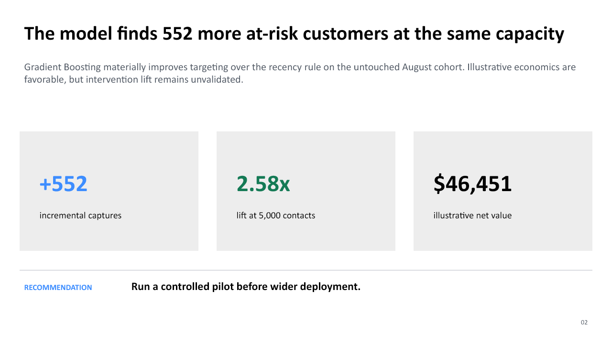

# PayWave Inactivity Prediction — Stakeholder Readout

> **Portfolio case study:** PayWave, its customers, and every result below are
> fictional and synthetically generated.

[Download the five-slide PowerPoint readout](stakeholder_readout.pptx)

## Decision

Proceed to a controlled operational pilot of model-ranked retention outreach.
Within the same 5,000-contact capacity, Gradient Boosting identifies materially
more future-inactive customers than the existing recency rule.

## Capacity-constrained evidence

| Metric | Gradient Boosting | Recency rule | Decision signal |
|---|---:|---:|---|
| Customers contacted | 5,000 | 5,000 | Same operating capacity |
| Precision@5,000 | **77.06%** | 66.02% | +11.04 pp |
| Recall@5,000 | **42.99%** | 36.83% | +6.16 pp |
| Lift@5,000 | **2.58x** | 2.21x | Better concentration of risk |
| Inactive customers captured | **3,853** | 3,301 | **+552 customers** |

The selected model improves captures by **16.7%** over the rule baseline without
increasing outreach volume.

## Validation design

- Features use only information available before each scoring date.
- Leakage candidates are explicitly removed.
- Model selection uses January–May training and June–July validation cohorts.
- The August Test cohort remains untouched until the model and policy are frozen.
- Test prevalence rises to 29.87%, intentionally testing temporal drift.
- PR AUC is prioritized because inactivity is a minority class and the business
  acts on a ranked list rather than a 0.50 threshold.

## Model comparison

| Candidate | Validation PR AUC | Captures at validation capacity |
|---|---:|---:|
| Gradient Boosting | **0.6525** | **7,209** |
| Logistic Regression | 0.6507 | 7,171 |
| Random Forest | 0.6489 | 7,169 |
| Recency business rule | 0.5693 | 5,839 |

Gradient Boosting wins, but its margin over Logistic Regression is small. A pilot
should confirm that the incremental performance justifies deployment complexity.

## Illustrative economics

Under the documented assumptions—18% intervention success, $85 retained value,
and $2.50 contact cost—the model produces **$46,450.90 illustrative net value**
per scoring cycle. This is a sensitivity estimate, not realized return. The model
predicts inactivity risk; it does not prove that outreach prevents inactivity.

## Pilot and monitoring plan

1. Randomize or phase outreach among eligible high-risk customers to estimate
   incremental retention lift.
2. Track contact success, retained activity, customer complaints, and realized value.
3. Monitor calibration, prevalence, feature availability, and segment outcomes.
4. Define drift, retraining, and rollback triggers before production expansion.
5. Compare the operational burden of Gradient Boosting with Logistic Regression.

## Limitations

Synthetic performance does not guarantee production performance. Segment PR AUC
varies partly with prevalence, the economic estimate depends on unvalidated
intervention assumptions, and repeated scoring requires careful governance.

## Reproducibility

The values come from deterministic generation with `SEED = 126`. See the
[reference results](../case_study/expected_results.md),
[methodology](../methodology.md), and [modeling code](../src/train_evaluate_models.py).
