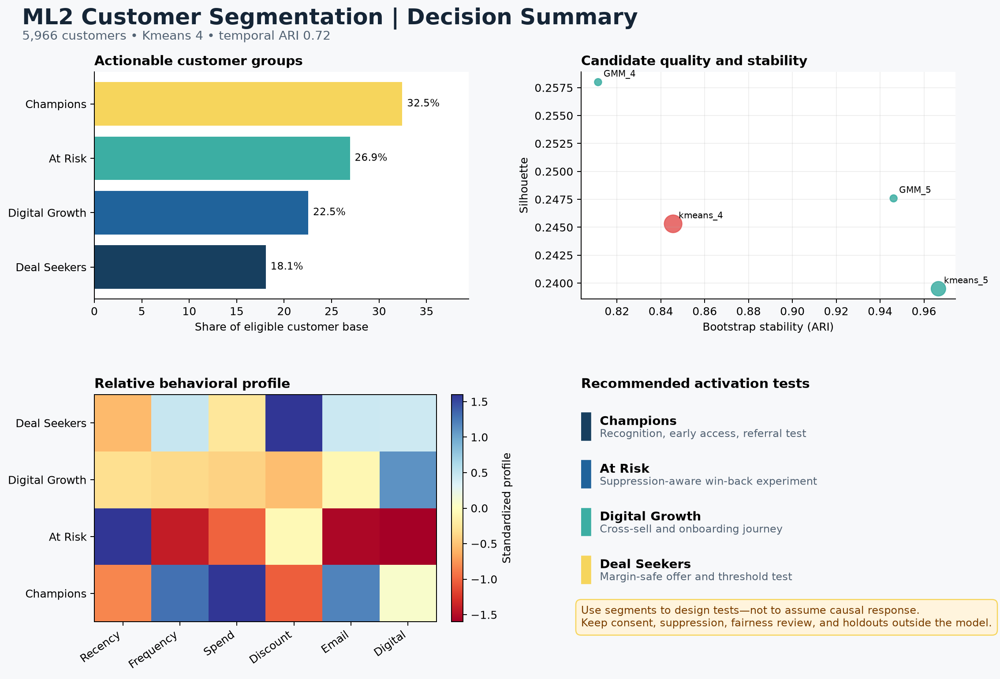

# ML2 — Customer Segmentation

**Decision:** Which durable, behaviorally distinct customer groups should guide differentiated marketing tests beyond fixed RFM rules?

Northstar Market currently uses broad lifecycle rules. This case compares K-means, Gaussian Mixture Models (GMM), and DBSCAN on two synthetic customer snapshots. Selection balances separation with stability, coverage, minimum segment size, interpretability, and operational usefulness.

## Result

K-means with four clusters is the reference solution. It segments **5,966 customers** with:

- **0.245 silhouette**, indicating useful but intentionally non-perfect behavioral separation
- **0.846 bootstrap stability ARI**
- **0.717 temporal assignment ARI** across two snapshots
- **100% coverage** and an **18.1% smallest-segment share**

The four interpretable groups are Champions, At Risk, Digital Growth, and Deal Seekers. The recommendation is to use these groups as testable planning hypotheses—not permanent customer identities or proof that an intervention will work.



## Review path

1. [Stakeholder readout](reports/stakeholder_readout.md)
2. [Business case](case_study/business_case.md)
3. [Expected results](case_study/expected_results.md)
4. [Segmentation fundamentals](customer_segmentation_fundamentals.md)
5. [Methodology](methodology.md)
6. [Model card](model_card/model_card.md)
7. [Monitoring plan](case_study/monitoring_plan.md)
8. [Source implementation](src)

## Reproduce

From the repository root:

```bash
python unsupervised_learning/customer_segmentation/src/generate_synthetic_data.py
python unsupervised_learning/customer_segmentation/src/segment_evaluate.py
python unsupervised_learning/customer_segmentation/src/create_visuals.py
pytest
```

The full generated dataset and processed assignments are intentionally ignored. A deterministic [review sample](data/raw/customer_snapshots_sample.csv) and [reference results](reports/reference_results.json) are versioned.

No challenge notebook is included; the reference workflow is tested source code.
